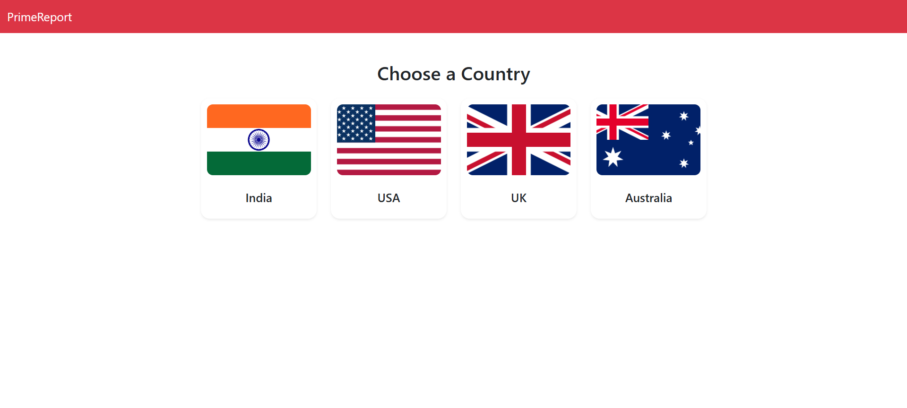
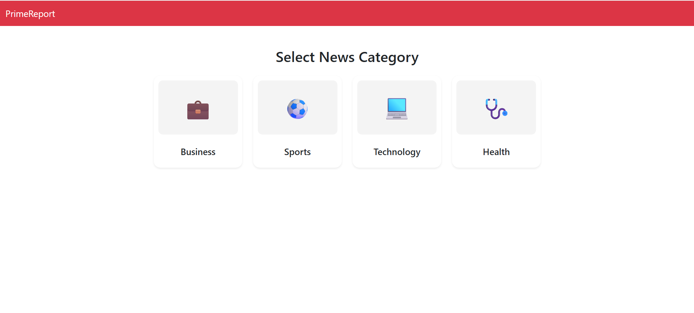
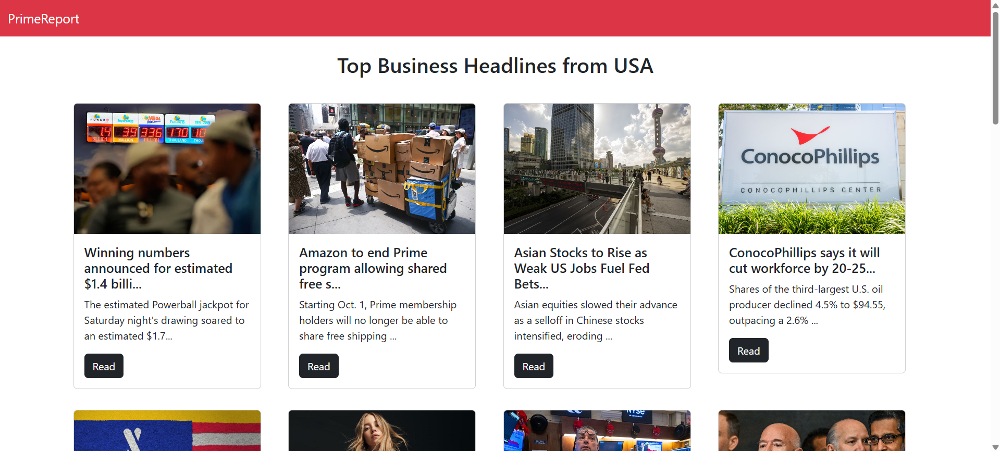

# Prime Report 📰

Prime Report is a **React-based news web application** built using **class-based components**.
It fetches real-time news from the [NewsAPI](https://newsapi.org/) and allows users to select their **preferred country** and **news category** before viewing the latest headlines.

---

## 🚀 Features

* Developed with **React (Class-Based Components)**
* Fetches live news from **NewsAPI**
* Filter news by **country** (India, USA, UK, Australia, etc.)
* Filter news by **category** (Business, Sports, Technology, Health, etc.)
* Responsive and minimal UI
* Clickable news cards with direct links to full articles

---

## 🛠️ Tech Stack

* **Frontend**: React (Class Components)
* **Styling**: CSS (mention if you used Bootstrap/Tailwind)
* **API**: [NewsAPI](https://newsapi.org/)

---

## 📦 Installation & Setup

1. Clone this repository:

   ```bash
   git clone https://github.com/your-username/prime-report.git
   cd prime-report
   ```

2. Install dependencies:

   ```bash
   npm install
   ```

3. Get your **NewsAPI key** from [NewsAPI.org](https://newsapi.org/).

4. Create a `.env` file in the root directory and add:

   ```env
   REACT_APP_NEWS_API_KEY=your_api_key_here
   ```

5. Run the development server:

   ```bash
   npm start
   ```

6. Open your browser and navigate to:

   ```
   http://localhost:3000
   ```

---

## 📸 Screenshots

### 🏳 Country Selection



### 📰 Category Selection



### 📊 News Feed Example



---

## 🙌 Contributing

Contributions are welcome!
Fork the repo → Create a new branch → Make your changes → Submit a PR.

👉 Do you want me to also include a **short code snippet of your main class component** (like `News.js`) in the README so that contributors can instantly understand how fetching is done?
